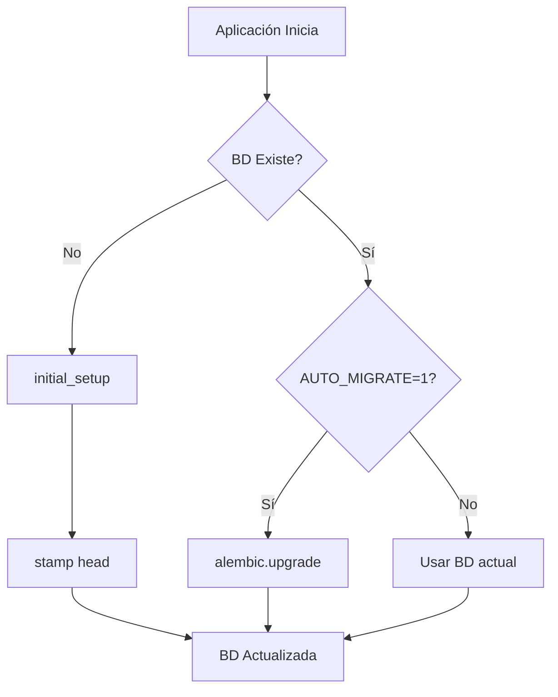

# flask-alembic en NOW LMS: Vista General

## 📋 ¿Qué es flask-alembic?

`flask-alembic` es una extensión de Flask que integra Alembic para gestionar migraciones de bases de datos de forma programática y versionada.

## 🏗️ Arquitectura en NOW LMS

```
now_lms/
├── __init__.py                           # Inicialización y configuración
│   └── alembic = Alembic()              # Instancia global
│
├── migrations/                           # ← Migraciones dentro del paquete
│   ├── script.py.mako                   # Plantilla para nuevas migraciones
│   ├── 20260105_145517_add_feature.py   # Migración ejemplo
│   └── ...                              # 11+ migraciones
│
├── cli.py                               # Comandos CLI personalizados
│   └── @database.command()
│       └── migrate()                    # lmsctl database migrate
│
├── config/
│   └── __init__.py                      # AUTO_MIGRATE configuración
│
└── db/
    └── __init__.py                      # Modelos SQLAlchemy
```

## 🔄 Flujo de Trabajo



## 🎯 Implementación: 3 Componentes Clave

### 1. Inicialización (`__init__.py`)

```python
from flask_alembic import Alembic

alembic = Alembic()

def inicializa_extenciones_terceros(flask_app):
    # Configurar ruta absoluta
    migrations_dir = abspath(join(dirname(__file__), "migrations"))
    flask_app.config["ALEMBIC"] = {"script_location": migrations_dir}
    
    # Inicializar en orden
    database.init_app(flask_app)
    alembic.init_app(flask_app)
```

### 2. Migraciones (`migrations/*.py`)

```python
"""Descripción del cambio

Revision ID: 20260125_120000
Revises: 20260120_100000
"""

def upgrade():
    # Verificar existencia (idempotente)
    conn = op.get_bind()
    inspector = sa.inspect(conn)
    
    if "tabla" in inspector.get_table_names():
        if "columna" not in [c["name"] for c in inspector.get_columns("tabla")]:
            op.add_column("tabla", sa.Column("columna", sa.String(255)))

def downgrade():
    # Revertir si existe
    pass
```

### 3. CLI (`cli.py`)

```python
@app.cli.group()
def database():
    """Database administration tools."""

@database.command()
def migrate():
    """Update database schema."""
    alembic.upgrade()
```

## 📊 Características Especiales

| Característica | NOW LMS | Implementación Básica |
|---------------|---------|----------------------|
| Ubicación migraciones | Dentro del paquete | En la raíz |
| Idempotencia | ✅ Sí | ❌ No |
| Auto-migración | ✅ Opcional | ❌ No |
| Multi-DB testing | ✅ SQLite/PG/MySQL | ❌ Solo una |
| CLI personalizado | ✅ lmsctl | ❌ Solo flask |
| Timestamp en nombres | ✅ Sí | ❌ No |
| Testing robusto | ✅ Ciclo completo | ❌ Básico |

## 🚀 Comandos Principales

```bash
# Inicializar nueva BD
lmsctl database init

# Migrar BD existente
lmsctl database migrate

# Ver versión actual
flask alembic current

# Ver historial
flask alembic history

# Retroceder
flask alembic downgrade -1
```

## 📖 Documentación Disponible

### Para Lectura Rápida
- 📄 [FLASK_ALEMBIC_SUMMARY.md](https://github.com/bmosoluciones/now-lms/blob/main/FLASK_ALEMBIC_SUMMARY.md) - Resumen ejecutivo con checklist

### Para Consulta Rápida
- 🔖 [flask-alembic-quick-reference.md](flask-alembic-quick-reference.md) - Comandos y ejemplos comunes

### Para Implementación Completa
- 📚 [flask-alembic-implementation.md](flask-alembic-implementation.md) - Guía completa en español (700+ líneas)
- 📚 [flask-alembic-implementation-en.md](flask-alembic-implementation-en.md) - Full guide in English

## 🎓 Ejemplo Completo: Agregar Columna

### 1. Crear Migración

```bash
# Crear archivo
touch now_lms/migrations/20260125_120000_add_user_phone.py
```

### 2. Implementar

```python
"""Add phone field to users table

Revision ID: 20260125_120000
Revises: 20260120_100000
Create Date: 2026-01-25 12:00:00
"""

from alembic import op
import sqlalchemy as sa

revision = "20260125_120000"
down_revision = "20260120_100000"


def upgrade():
    conn = op.get_bind()
    inspector = sa.inspect(conn)
    
    if "usuario" in inspector.get_table_names():
        columns = [col["name"] for col in inspector.get_columns("usuario")]
        
        if "telefono" not in columns:
            op.add_column(
                "usuario",
                sa.Column("telefono", sa.String(20), nullable=True)
            )


def downgrade():
    conn = op.get_bind()
    inspector = sa.inspect(conn)
    
    if "usuario" in inspector.get_table_names():
        columns = [col["name"] for col in inspector.get_columns("usuario")]
        
        if "telefono" in columns:
            op.drop_column("usuario", "telefono")
```

### 3. Probar

```bash
# Test local
pytest tests/test_alembic_upgrade.py -v

# Aplicar migración
lmsctl database migrate
```

### 4. Verificar

```bash
flask alembic current
# Output: 20260125_120000 (head)
```

## ✅ Checklist Rápido para Replicar

- [ ] Instalar: `pip install flask-alembic==3.2.0 alembic==1.18.1`
- [ ] Crear: `app/migrations/` + `script.py.mako`
- [ ] Configurar: `ALEMBIC.script_location` en `__init__.py`
- [ ] Inicializar: `alembic.init_app(app)` después de SQLAlchemy
- [ ] Crear: Primera migración con formato `YYYYMMDD_HHMMSS_descripcion.py`
- [ ] CLI: Comando `database migrate`
- [ ] Testing: Test de upgrade/downgrade
- [ ] Docs: Documentar convenciones

## 💡 Mejores Prácticas Clave

1. ✅ **Migraciones idempotentes** - Verificar antes de crear
2. ✅ **Valores por defecto** - `server_default` para NOT NULL
3. ✅ **Testing completo** - Upgrade → Downgrade → Upgrade
4. ✅ **Multi-DB** - Probar SQLite, PostgreSQL, MySQL
5. ✅ **Documentación** - Explicar el QUÉ y el POR QUÉ

## 🔗 Enlaces Útiles

- [NOW LMS Repository](https://github.com/bmosoluciones/now-lms)
- [Alembic Docs](https://alembic.sqlalchemy.org/)
- [flask-alembic GitHub](https://github.com/davidism/flask-alembic)

---

**Actualizado:** 2026-01-25  
**NOW LMS:** v1.0.0+  
**flask-alembic:** 3.2.0
